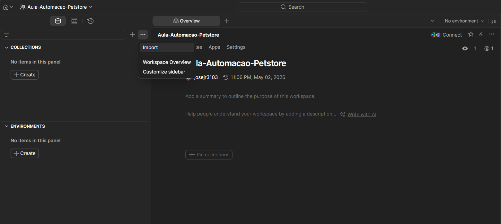
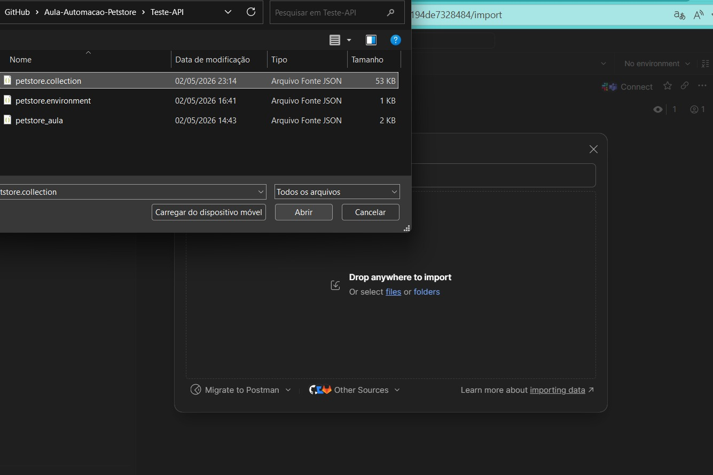
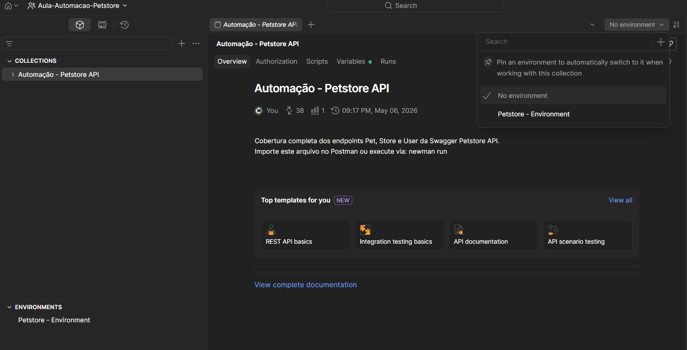
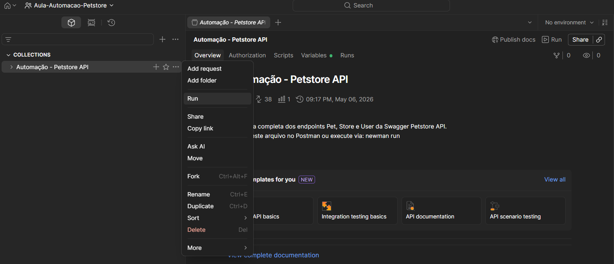
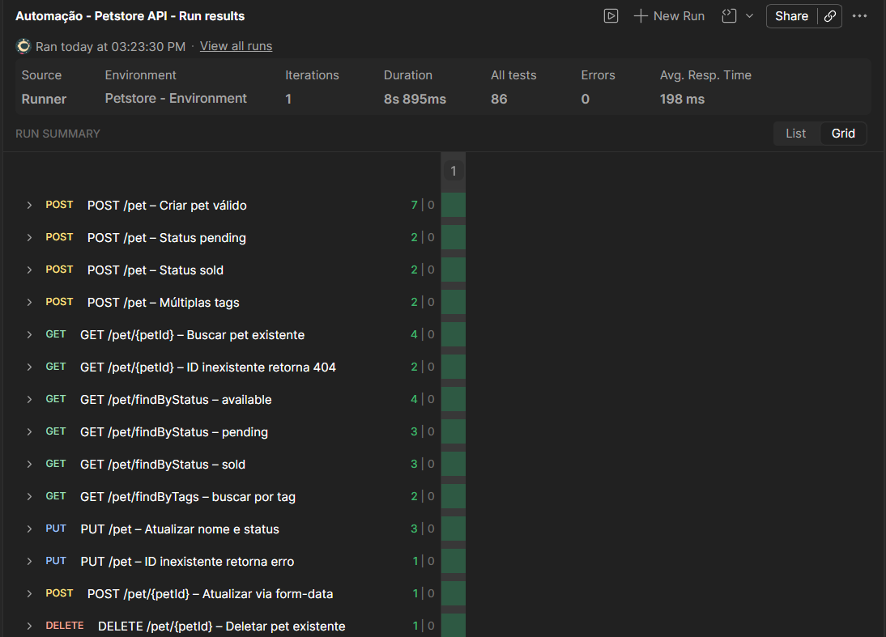
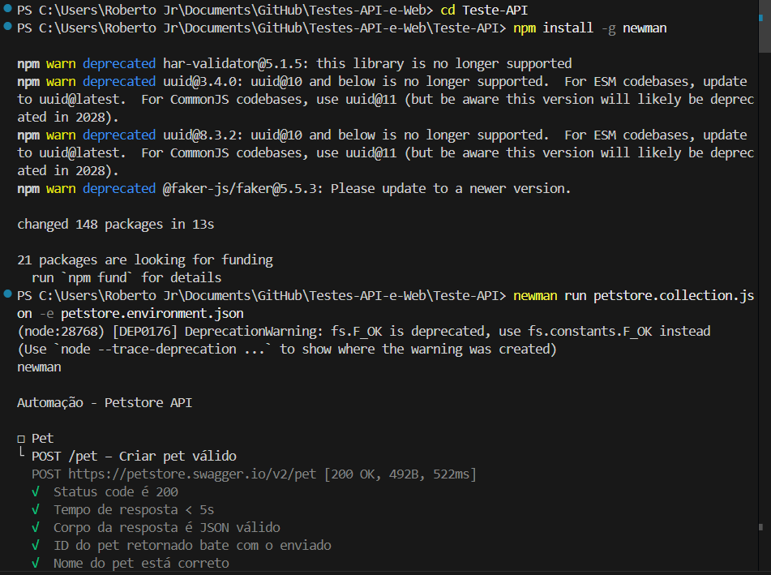
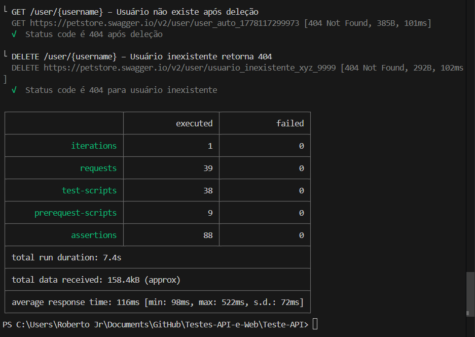
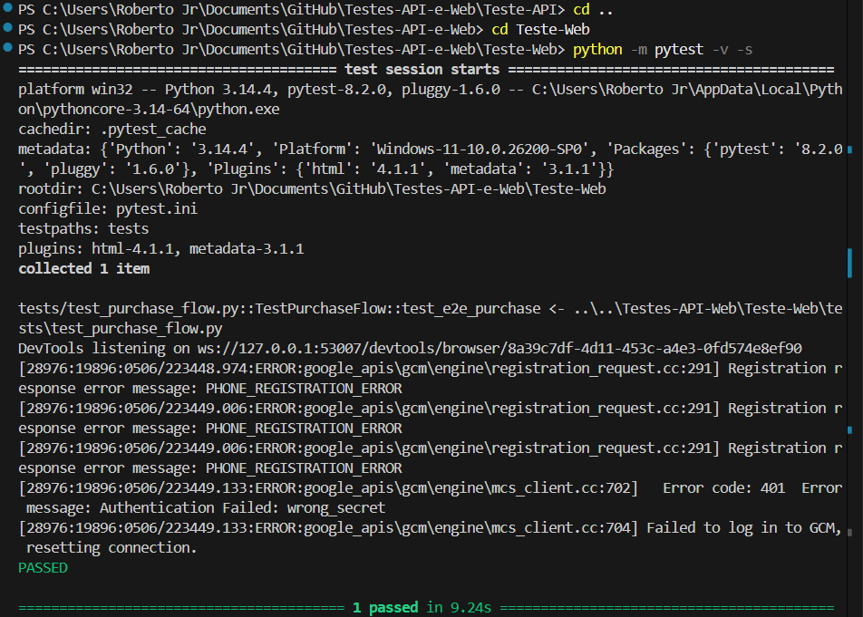
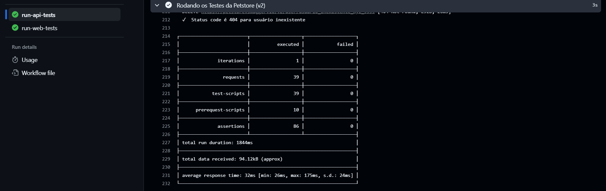
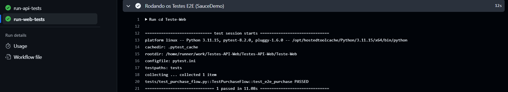

# Testes API e Web

Projeto de automação que contém testes de API para a Petstore e testes E2E de frontend usando Selenium/Pytest. O foco é validar o fluxo de compra e as principais operações da API de testes.

## Tecnologias utilizadas

- Postman
- Newman
- Python 3.x
- Selenium 4.21.0
- Pytest 8.2.0
- GitHub Actions

## Estrutura do projeto

- `Teste-API/`
  - `petstore_aula.json`
  - `petstore.collection.json`
  - `petstore.environment.json`
- `Teste-Web/`
  - `conftest.py`
  - `pytest.ini`
  - `requirements.txt`
  - `pages/`
    - `__init__.py`
    - `base_page.py`
    - `cart_page.py`
    - `checkout_page.py`
    - `inventory_page.py`
    - `login_page.py`
  - `tests/`
    - `test_purchase_flow.py`
  - `utils/`
    - `__init__.py`
    - `driver_factory.py`
- `assets/ #Contém apenas imagens de execução e prints do processo` 
- `.github/workflows/`
  - `main.yml`


## Instalação

1. Clone o repositório:

```bash
git clone https://github.com/Josejr3103/Testes-API-e-Web.git
cd Testes-API-e-Web
```

2. Instale as dependências do projeto Web:

```bash
python -m pip install --upgrade pip
pip install -r Teste-Web/requirements.txt
```

3. Para executar os testes de API no terminal com Newman, instale o Newman globalmente:

```bash
npm install -g newman
```

## Execução API

### Via Postman

1. Abra o Postman.
2. Importe a coleção e o ambiente usando os arquivos em `Teste-API/`.
   - 
   - 
3. Selecione o ambiente apropriado para a coleção.
   - 
4. Execute a coleção `Automação - Petstore API` no Collection Runner.
   - 
5. Confira os resultados na grade de execução.
   - 

### Via terminal

1. Instale o Newman se ainda não estiver instalado:

```bash
npm install -g newman
```

2. Execute a coleção com ambiente:

```bash
newman run Teste-API/petstore.collection.json -e Teste-API/petstore.environment.json --reporters cli
```

3. O terminal exibirá o processo de execução e os resultados.
   - 
   - 

### Cobertura dos testes de API

- `iterations`: número de vezes que a coleção é executada no Collection Runner.
- `requests`: cada requisição enviada durante a execução da coleção.
- `prerequest-scripts`: scripts executados antes de cada requisição para preparar variáveis ou configurar dados.
- `test-scripts`: scripts executados após cada requisição para validar respostas, status e conteúdo.

## Execução Web

1. Abra um terminal e navegue até a pasta do projeto Web:

```bash
cd Teste-Web
```

2. Execute os testes:

```bash
pytest -v -s
```

3. O terminal exibirá todo o processo de execução dos testes.
   - 

### Cobertura dos testes Web

Os testes Web cobrem o fluxo de compra completo no ambiente SauceDemo, incluindo:
- login de usuário;
- navegação pelo inventário;
- adição de item ao carrinho;
- ação de checkout;
- validação do fluxo de finalização de pedido.

## Pipeline CI/CD

O pipeline no GitHub Actions executa os testes automaticamente em cada push e pull request para a branch `main`.

- Testes de API são executados com Newman:
  - `Teste-API/petstore_aula.json`
  - `Teste-API/petstore.collection.json` com `Teste-API/petstore.environment.json`
- Testes Web são executados com Python e Pytest em `Teste-Web`.

Prints de execução do pipeline:
- 
- 

## Dificuldades

- Dificuldade API: entendimento do funcionamento da API de testes.
  - Solução: buscar entender os casos de testes que estavam dando erro e adaptar para passar, com comentário de erro conhecido.
  - 

- Dificuldades Web: problemas com a linguagem e com o driver do Chrome.
  - Solução: estruturar melhor o código e baixar manualmente o driver do Chrome.

- Dificuldade CI/CD: mesmo o código rodando localmente, no GitHub Actions algumas funções de click e transição de página falhavam.
  - Solução: refazer as funções para usar script JS; posteriormente descobri que um possível problema era a aparição de um popup no ambiente do GitHub Actions que impedia alguns clicks e culminava no erro de TimeOut.Exception.
